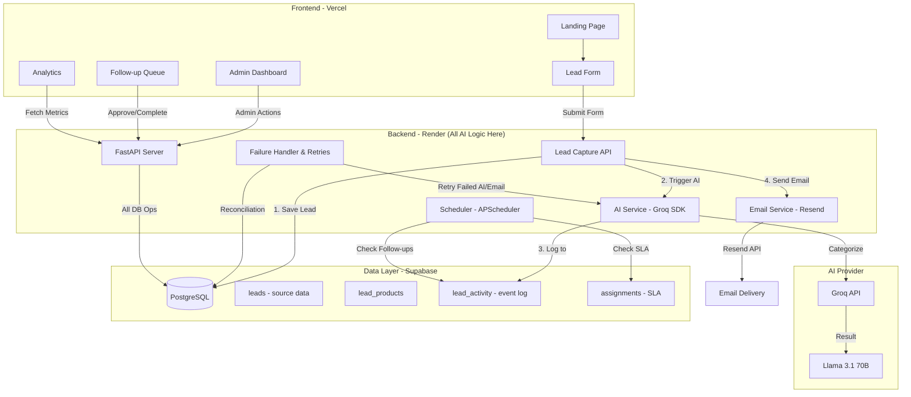

# AI-Powered Lead Management Automation System
## Implementation Plan for Material Brands in India

---

## 📋 Project Overview

### Problem Statement
Material brands in India (flooring, laminates, lighting) lose significant leads due to:
- Delayed or missed responses to product inquiries
- Lack of systematic lead capture and categorization
- No automated nurturing workflows
- Inefficient manual follow-up processes
- Poor visibility into lead pipeline

### Solution
An AI-powered lead management automation system that captures, categorizes, nurtures, and converts website inquiries into customers with minimal manual intervention.

### Tech Stack (Senior Design Review - Simplified)

> **Design Decision**: Backend-only AI orchestration. Frontend consumes REST APIs only.

| Component | Technology | Justification |
|-----------|------------|---------------|
| Frontend | React + Vite | Modern, fast, component-based UI |
| Backend | Python (FastAPI) | Async support, modern Python, great for AI integration |
| Database | Supabase (PostgreSQL) | Managed Postgres with real-time, RLS, and auth |
| AI/LLM | Groq SDK (Python) | Fast inference, Llama 3.1 models, JSON mode support |
| Email | Resend | Modern email API, good deliverability |
| Deployment | Vercel (Frontend) + Render (Backend) | Easy deployment, auto-scaling |

**Note**: All AI logic resides in backend. No Vercel AI SDK needed - we use Groq SDK directly in Python backend.

---

## 🏗️ System Architecture (Simplified & AI-First)



**Key Principles**:
- ✅ Frontend is purely presentational (no AI)
- ✅ All AI calls from backend via Groq SDK
- ✅ Event-sourcing via `lead_activity` table
- ✅ Resilient with fallbacks and retries

---

## 📊 Database Schema (Simplified & AI-First)

> **Design Philosophy**: Keep source data pure in `leads` table. Store ALL AI results, follow-ups, and approvals as activities in `lead_activity` table using event-sourcing pattern.

### 1. Leads Table (SOURCE DATA ONLY - No AI Pollution)
```sql
CREATE TABLE leads (
    id UUID PRIMARY KEY DEFAULT uuid_generate_v4(),
    created_at TIMESTAMP DEFAULT NOW(),
    updated_at TIMESTAMP DEFAULT NOW(),
    
    -- Contact Information (SOURCE DATA ONLY)
    name VARCHAR(255) NOT NULL,
    email VARCHAR(255) NOT NULL,
    phone VARCHAR(20),
    company VARCHAR(255),
    role VARCHAR(100), -- Home Owner, Architect, Builder, Contractor
    location VARCHAR(255),
    
    -- Lead Details (SOURCE DATA ONLY)
    message TEXT,
    source VARCHAR(100) DEFAULT 'website_form', -- website_form, referral, campaign
    
    -- Status Tracking (HUMAN-SET ONLY - NOT AI)
    status VARCHAR(50) DEFAULT 'new', -- new, contacted, nurturing, qualified, converted, lost
    
    -- Metadata
    first_response_at TIMESTAMP,
    last_contact_at TIMESTAMP,
    conversion_date TIMESTAMP
);

CREATE INDEX idx_leads_status ON leads(status);
CREATE INDEX idx_leads_created_at ON leads(created_at DESC);
CREATE INDEX idx_leads_email ON leads(email);
```

**Key Point**: ❌ NO AI fields (category, intent, sentiment, priority_score) in this table!

---

### 2. Lead Products Table (Product Interests)
```sql
CREATE TABLE lead_products (
    id UUID PRIMARY KEY DEFAULT uuid_generate_v4(),
    lead_id UUID NOT NULL REFERENCES leads(id) ON DELETE CASCADE,
    created_at TIMESTAMP DEFAULT NOW(),
    
    -- Product Information
    category VARCHAR(100) NOT NULL, -- Flooring, Wall, Lighting, Laminates
    product VARCHAR(255) NOT NULL,  -- Laminate Flooring, Wall Panels, etc.
    
    quantity VARCHAR(100), -- Optional: area/units needed
    notes TEXT
);

CREATE INDEX idx_lead_products_lead_id ON lead_products(lead_id);
CREATE INDEX idx_lead_products_category ON lead_products(category);
```

---

### 3. Lead Activity Table (EVENT LOG - The Heart of the System)

**This table stores EVERYTHING**: AI results, assignments, emails, follow-ups, approvals, notes

```sql
CREATE TABLE lead_activity (
    id UUID PRIMARY KEY DEFAULT uuid_generate_v4(),
    lead_id UUID NOT NULL REFERENCES leads(id) ON DELETE CASCADE,
    created_at TIMESTAMP DEFAULT NOW(),
    updated_at TIMESTAMP DEFAULT NOW(),
    
    -- Activity Details
    type VARCHAR(50) NOT NULL, 
    -- Types: 'ai_result', 'assignment', 'email', 'call', 'follow_up', 'approval', 'status_change', 'note'
    
    status VARCHAR(50) DEFAULT 'completed',
    -- For follow_ups: 'pending', 'completed', 'cancelled'
    -- For approvals: 'pending', 'approved', 'rejected'
    -- For others: 'completed'
    
    message TEXT NOT NULL,
    
    -- Actor
    actor_type VARCHAR(50) DEFAULT 'system', -- 'system', 'user', 'ai'
    actor_id VARCHAR(255), -- User ID if manual action
    
    -- Additional Data (FLEXIBLE JSON)
    metadata JSONB
);

CREATE INDEX idx_lead_activity_lead_id ON lead_activity(lead_id);
CREATE INDEX idx_lead_activity_type ON lead_activity(type);
CREATE INDEX idx_lead_activity_status ON lead_activity(status);
CREATE INDEX idx_lead_activity_created_at ON lead_activity(created_at DESC);
CREATE INDEX idx_lead_activity_metadata ON lead_activity USING GIN (metadata);
```

**Activity Type Examples (with Versioning)**:

| Type | Status | Metadata Example |
|------|--------|------------------|
| `ai_result` | `completed` | `{"intent": "quote_request", "priority": "high", "model": "llama-3.1-70b", "prompt_version": "v1.0", "input": {...}}` |
| `assignment` | `completed` | `{"owner_id": "user_12", "owner_name": "Rajesh", "sla_deadline": "...", "sla_policy": "hot_lead_1_hour"}` |
| `email` | `completed` | `{"template": "acknowledgement", "channel": "resend", "resend_id": "msg_abc123"}` |
| `email` | `failed` | `{"template": "acknowledgement", "error": "timeout", "retry_count": 3}` |
| `follow_up` | `pending` | `{"action": "call", "scheduled_for": "2024-12-24T11:00:00Z", "reason": "high_priority_lead"}` |
| `approval` | `pending` | `{"approval_type": "high_value_lead", "ai_recommendation": "...", "requires_manager": true}` |

**Critical Design Note**: Always store `model` and `prompt_version` in AI results for debugging and accuracy tracking.

---

### 4. Assignments Table (Owner & SLA Tracking)
```sql
CREATE TABLE assignments (
    id UUID PRIMARY KEY DEFAULT uuid_generate_v4(),
    lead_id UUID NOT NULL REFERENCES leads(id) ON DELETE CASCADE,
    assigned_at TIMESTAMP DEFAULT NOW(),
    
    -- Assignment Details
    owner_id VARCHAR(255) NOT NULL,
    owner_name VARCHAR(255),
    
    -- SLA Tracking
    sla_deadline TIMESTAMP NOT NULL,
    sla_met BOOLEAN,
    response_time_minutes INTEGER,
    
    -- Status
    status VARCHAR(50) DEFAULT 'active', -- active, completed, reassigned
    completed_at TIMESTAMP
);

CREATE INDEX idx_assignments_lead_id ON assignments(lead_id);
CREATE INDEX idx_assignments_owner_id ON assignments(owner_id);
CREATE INDEX idx_assignments_sla_deadline ON assignments(sla_deadline);
```

---

## ✅ FINAL Lead Flow (Corrected & Approved)

### Scenario: User submits website inquiry for multiple products

**API Request (POST `/api/leads`)**
```json
{
  "name": "Amit Verma",
  "email": "amit@gmail.com",
  "phone": "+91 9876500011",
  "company": "",
  "role": "Home Owner",
  "location": "Noida",
  "product_interests": [
    { "category": "Flooring", "product": "Laminate Flooring" },
    { "category": "Wall", "product": "Wall Panels" }
  ],
  "message": "Need materials for 3BHK renovation",
  "source": "website_form"
}
```

---

### Step 1: Insert into `leads` (SOURCE DATA ONLY)

```sql
INSERT INTO leads (
  id, name, email, phone, company, role,
  location, source, status, message, created_at
)
VALUES (
  'uuid-1',
  'Amit Verma',
  'amit@gmail.com',
  '+91 9876500011',
  '',
  'Home Owner',
  'Noida',
  'website_form',
  'new',
  'Need materials for 3BHK renovation',
  NOW()
);
```

✅ No AI fields  
✅ No assignment here

---

### Step 2: Insert into `lead_products`

```sql
INSERT INTO lead_products (id, lead_id, category, product, created_at)
VALUES
  ('uuid-p1', 'uuid-1', 'Flooring', 'Laminate Flooring', NOW()),
  ('uuid-p2', 'uuid-1', 'Wall', 'Wall Panels', NOW());
```

---

### Step 3: AI Categorization (AI-FIRST, NO DB POLLUTION)

```python
ai_result = await ai_service.categorize_lead({
    "role": "Home Owner",
    "location": "Noida",
    "products": ["Laminate Flooring", "Wall Panels"],
    "message": "Need materials for 3BHK renovation"
})

# Example AI Output:
# {
#   "intent": "quote_request",
#   "lead_type": "home_owner",
#   "priority": "high",
#   "suggested_action": "call_within_30_min"
# }
```

❌ **DO NOT update `leads` table**

---

### Step 4: Log AI Result → `lead_activity` (WITH VERSIONING)

```sql
INSERT INTO lead_activity (
  id, lead_id, type, status, message, actor_type, metadata, created_at
)
VALUES (
  'uuid-act1',
  'uuid-1',
  'ai_result',
  'completed',
  'AI analyzed lead and suggested priority action',
  'ai',
  '{
    "input": {
      "role": "Home Owner",
      "location": "Noida",
      "products": ["Laminate Flooring", "Wall Panels"],
      "message": "Need materials for 3BHK renovation"
    },
    "output": {
      "intent": "quote_request",
      "lead_type": "home_owner",
      "priority": "high",
      "suggested_action": "call_within_30_min"
    },
    "model": "llama-3.1-70b-versatile",
    "prompt_version": "v1.0",
    "timestamp": "2024-12-24T11:30:00Z"
  }',
  NOW()
);
```

**Why Store Input**: Enables replay with different models for accuracy measurement.

---

### Step 5: Auto-assign Lead (RULE-BASED)

```sql
INSERT INTO assignments (
  id, lead_id, owner_id, owner_name, sla_deadline, assigned_at
)
VALUES (
  'uuid-a1',
  'uuid-1',
  'sales_user_12',
  'Rajesh Kumar',
  NOW() + INTERVAL '1 hour',
  NOW()
);
```

---

### Step 6: Log Assignment Activity

```sql
INSERT INTO lead_activity (
  id, lead_id, type, status, message, actor_type, metadata, created_at
)
VALUES (
  'uuid-act2',
  'uuid-1',
  'assignment',
  'completed',
  'Lead auto-assigned to Rajesh Kumar',
  'system',
  '{
    "assigned_by": "system",
    "owner_id": "sales_user_12",
    "owner_name": "Rajesh Kumar",
    "sla_deadline": "2024-12-24T11:30:00Z"
  }',
  NOW()
);
```

---

### Step 7: Send Auto-Acknowledgement Email

*(Template + light AI personalization)*

```python
await email_service.send_acknowledgement(
    to_email="amit@gmail.com",
    name="Amit Verma",
    products=["Laminate Flooring", "Wall Panels"]
)
```

---

### Step 8: Log Email Activity

```sql
INSERT INTO lead_activity (
  id, lead_id, type, status, message, actor_type, metadata, created_at
)
VALUES (
  'uuid-act3',
  'uuid-1',
  'email',
  'completed',
  'Acknowledgement email sent to customer',
  'system',
  '{
    "template": "acknowledgement",
    "channel": "resend"
  }',
  NOW()
);

UPDATE leads
SET first_response_at = NOW()
WHERE id = 'uuid-1';
```

---

### Step 9: Create Follow-Up (NO TASK TABLE - Store as Activity)

```sql
INSERT INTO lead_activity (
  id, lead_id, type, status, message, metadata, created_at
)
VALUES (
  'uuid-act4',
  'uuid-1',
  'follow_up',
  'pending',
  'Sales call follow-up scheduled',
  '{
    "action": "call",
    "scheduled_for": "2024-12-24T11:00:00Z",
    "reason": "high_priority_lead"
  }',
  NOW()
);
```

**Background worker** executes this when scheduled.

---

### Step 10: Human-in-the-Loop (Approval as Activity)

```sql
INSERT INTO lead_activity (
  id, lead_id, type, status, message, metadata, created_at
)
VALUES (
  'uuid-act5',
  'uuid-1',
  'approval',
  'pending',
  'Approval required for high-value lead handling',
  '{
    "approval_type": "high_value_lead",
    "ai_recommendation": "Call within 30 minutes and propose site visit"
  }',
  NOW()
);
```

Manager approves → Update: `status = 'approved'` → Automation continues.

---

## 🔑 Why This Flow is Correct

✅ **No extra tables**: Only 4 core tables  
✅ **AI-first, but auditable**: All AI outputs logged as activities  
✅ **Event sourcing**: Complete audit trail  
✅ **No DB pollution**: Source data stays pure  
✅ **Human-in-the-loop**: Approvals as activities with status  
✅ **Website-only scope**: Simple, focused  
✅ **Demo-friendly**: Easy to explain  
✅ **Interview-safe**: Best practices demonstrated

---

## 🔄 Phase-Wise Implementation

### **Phase 1: Problem Analysis & Documentation** (Days 1-2)

#### Objectives
- Understand pain points of material brands
- Document solution architecture
- Create 2-page problem-solving document

#### Deliverables
1. **Problem-Solving Document** (Max 2 pages)
   - Current state analysis
   - Root cause identification
   - Proposed solutions (tech + non-tech)
   - ROI projections
   - Implementation roadmap

#### Key Activities
- Research industry-specific challenges
- Define lead categorization criteria:
  - **Hot**: Immediate quote requests, budget confirmed
  - **Warm**: Product research, timeline in 1-3 months
  - **Cold**: General inquiry, no timeline
  - **Junk**: Spam, competitors, irrelevant
- Map customer journey and touchpoints
- Identify human-in-the-loop decision points

---

### **Phase 2: Project Setup & Infrastructure** (Days 2-3)

#### Frontend Setup (No AI SDK - Backend Only)
```bash
npm create vite@latest lead-automation-frontend -- --template react-ts
cd lead-automation-frontend
npm install
npm install @supabase/supabase-js
npm install react-router-dom recharts lucide-react axios
npm install -D tailwindcss postcss autoprefixer
npx tailwindcss init -p
```

**Note**: No Vercel AI SDK. Frontend consumes backend REST APIs only.

#### Backend Setup
```bash
mkdir lead-automation-backend
cd lead-automation-backend
python -m venv venv
source venv/bin/activate  # Windows: venv\Scripts\activate

pip install fastapi uvicorn
pip install supabase
pip install groq
pip install resend
pip install apscheduler
pip install pydantic pydantic-settings
pip install python-multipart
```

#### Environment Configuration

**.env (Backend)**
```env
# Supabase
SUPABASE_URL=your_supabase_url
SUPABASE_ANON_KEY=your_supabase_anon_key
SUPABASE_SERVICE_KEY=your_service_key

# Groq
GROQ_API_KEY=your_groq_api_key

# Resend
RESEND_API_KEY=your_resend_api_key
RESEND_FROM_EMAIL=leads@yourdomain.com

# App Config
APP_ENV=development
CORS_ORIGINS=http://localhost:5173
```

**.env (Frontend)**
```env
VITE_SUPABASE_URL=your_supabase_url
VITE_SUPABASE_ANON_KEY=your_supabase_anon_key
VITE_API_URL=http://localhost:8000
```

#### Deliverables
- ✅ Initialized repositories
- ✅ Configured environment variables
- ✅ Created project structure
- ✅ Set up version control (Git)

---

### **Phase 3: Database Schema & Models** (Days 3-4)

#### Database Design Philosophy
**Event-Sourcing Pattern**: Keep source data pure. Store ALL AI results, follow-ups, and approvals as activities in the `lead_activity` table.

#### Supabase Setup Process
1. Create new Supabase project
2. Enable UUID extension: `CREATE EXTENSION IF NOT EXISTS "uuid-ossp";`
3. Run SQL migrations to create all 4 tables:
   - **`leads`** (source data ONLY - no AI fields)
   - **`lead_products`** (product interests)
   - **`lead_activity`** (EVENT LOG - AI results, follow-ups, approvals, all activities)
   - **`assignments`** (owner & SLA tracking)
4. Set up Row Level Security (RLS) policies
5. Create database indexes for performance
6. Create database triggers for SLA evaluation and response time calculation
7. Create database functions (`get_lead_full`, `get_dashboard_stats`, `get_pending_follow_ups`)
8. Set up real-time subscriptions for dashboard

#### Key Design Decisions

**✅ DO:**
- Store raw form data in `leads` table
- Store all AI analysis in `lead_activity` with type='ai_result'
- Store follow-ups as activities with type='follow_up', status='pending'
- Store approvals as activities with type='approval', status='pending'
- Use `metadata` JSONB field for flexible activity-specific data

**❌ DON'T:**
- Pollute `leads` table with AI-generated fields
- Create separate tables for tasks/approvals (use activities instead)
- Update `leads` table with AI categorization

#### RLS Policies Example
```sql
-- Allow public (anonymous) to insert leads
CREATE POLICY "Anyone can submit leads"
ON leads FOR INSERT
TO anon
WITH CHECK (true);

-- Allow public to insert lead products
CREATE POLICY "Anyone can add lead products"
ON lead_products FOR INSERT
TO anon
WITH CHECK (true);

-- System can log activities
CREATE POLICY "System can log activity"
ON lead_activity FOR INSERT
TO anon, authenticated
WITH CHECK (true);

-- Authenticated users can view everything
CREATE POLICY "Authenticated users can view leads"
ON leads FOR SELECT
TO authenticated
USING (true);

-- Authenticated users can update activity status (approvals, follow-ups)
CREATE POLICY "Authenticated users can update activity status"
ON lead_activity FOR UPDATE
TO authenticated
USING (true);
```

#### Database Functions
```sql
-- Function to get lead with all related data
CREATE OR REPLACE FUNCTION get_lead_full(lead_uuid UUID)
RETURNS JSON AS $$
DECLARE
  result JSON;
BEGIN
  SELECT json_build_object(
    'lead', row_to_json(l.*),
    'products', (SELECT json_agg(lp.*) FROM lead_products lp WHERE lp.lead_id = lead_uuid),
    'current_assignment', (SELECT row_to_json(a.*) FROM assignments a WHERE a.lead_id = lead_uuid AND a.status = 'active' LIMIT 1),
    'ai_analysis', (SELECT metadata FROM lead_activity WHERE lead_id = lead_uuid AND type = 'ai_result' ORDER BY created_at DESC LIMIT 1),
    'activities', (SELECT json_agg(la.*) FROM lead_activity la WHERE la.lead_id = lead_uuid ORDER BY created_at DESC),
    'pending_follow_ups', (SELECT json_agg(la.*) FROM lead_activity la WHERE la.lead_id = lead_uuid AND la.type = 'follow_up' AND la.status = 'pending'),
    'pending_approvals', (SELECT json_agg(la.*) FROM lead_activity la WHERE la.lead_id = lead_uuid AND la.type = 'approval' AND la.status = 'pending')
  ) INTO result
  FROM leads l
  WHERE l.id = lead_uuid;
  
  RETURN result;
END;
$$ LANGUAGE plpgsql;
```

#### Deliverables
- ✅ All 4 tables created with proper constraints
- ✅ Event-sourcing pattern implemented (AI results are append-only, never updated)
- ✅ RLS policies configured for security
- ✅ Database indexes optimized
- ✅ Triggers for SLA evaluation and response time calculation
- ✅ Database functions created
- ✅ Real-time subscriptions enabled
- ✅ Complete SQL file ready (`database_schema.sql`)
- ✅ Seed data for testing

---

### **Phase 4: Backend Development** (Days 4-8)

#### Project Structure
```
lead-automation-backend/
├── app/
│   ├── main.py                 # FastAPI app entry
│   ├── config.py               # Settings & environment
│   ├── models/
│   │   ├── lead.py
│   │   ├── activity.py
│   │   └── assignment.py
│   ├── services/
│   │   ├── ai_service.py       # Groq integration
│   │   ├── email_service.py    # Resend integration
│   │   ├── lead_service.py     # Business logic
│   │   └── scheduler_service.py
│   ├── api/
│   │   ├── leads.py            # Lead endpoints
│   │   ├── approvals.py        # Approval endpoints
│   │   └── analytics.py        # Analytics endpoints
│   └── utils/
│       ├── db.py               # Supabase client
│       └── helpers.py
├── requirements.txt
└── README.md
```

#### Key API Endpoints (Simplified & Clear)

| Method | Endpoint | Description |
|--------|----------|-------------|
| **Leads** |||
| POST | `/api/leads` | Capture new lead (with products) |
| GET | `/api/leads` | List all leads (with filters) |
| GET | `/api/leads/{id}` | Get full lead details (with products, activities) |
| PUT | `/api/leads/{id}` | Update lead information |
| PUT | `/api/leads/{id}/status` | Update lead status |
| POST | `/api/leads/{id}/recategorize` | Manually trigger AI re-categorization |
| **Products** |||
| GET | `/api/leads/{id}/products` | Get lead's product interests |
| POST | `/api/leads/{id}/products` | Add product to lead |
| **Activities** |||
| GET | `/api/leads/{id}/activities` | Get lead activity timeline |
| POST | `/api/leads/{id}/activities` | Log manual activity |
| GET | `/api/activities?type=follow_up&status=pending` | Query activities by type/status |
| **Assignments** |||
| GET | `/api/assignments` | List assignments (by owner) |
| POST | `/api/assignments/{id}/complete` | Mark assignment complete |
| GET | `/api/assignments/sla-violations` | Get SLA violations |
| **Follow-ups** (No separate table - uses activities) |||
| GET | `/api/follow-ups/pending` | Get pending follow-ups |
| POST | `/api/follow-ups/{id}/complete` | Mark follow-up as completed |
| PUT | `/api/follow-ups/{id}/snooze` | Snooze follow-up |
| **Approvals** (Stored as activities) |||
| GET | `/api/approvals/pending` | List pending approvals |
| POST | `/api/approvals/{id}/approve` | Approve action |
| POST | `/api/approvals/{id}/reject` | Reject action |
| **Analytics** |||
| GET | `/api/analytics/dashboard` | Get dashboard stats |
| GET | `/api/analytics/conversion` | Get conversion funnel |
| GET | `/api/analytics/sla-performance` | Get SLA metrics |
| **Health & Monitoring** |||
| GET | `/api/health` | Basic health check |
| GET | `/api/health/ai-metrics` | AI success rate, failures, avg response time |
| GET | `/api/health/email-metrics` | Email delivery stats |
| **Admin** |||
| POST | `/api/admin/retry-failed-ai/{lead_id}` | Retry failed AI categorization |
| POST | `/api/admin/retry-failed-email/{activity_id}` | Retry failed email |
| GET | `/api/admin/orphaned-leads` | Find leads without activities |

**Design Note**: No `/api/tasks` endpoints. "Tasks" terminology eliminated. Use "follow-ups" instead.

#### AI Service Implementation (ai_service.py) - Production Ready

```python
from groq import Groq
from typing import Dict, Any, Optional
import json
from datetime import datetime
import logging

logger = logging.getLogger(__name__)

class AIService:
    """
    Production-ready AI service with:
    - Versioning for auditability
    - Fallback categorization
    - Retry logic
    - Error handling
    """
    
    MODEL_VERSION = "llama-3.1-70b-versatile"
    PROMPT_VERSION = "v1.0"  # Increment when changing prompts
    
    def __init__(self, api_key: str):
        self.client = Groq(api_key=api_key)
    
    async def categorize_lead(
        self, 
        lead_data: Dict[str, Any],
        retry_count: int = 3
    ) -> Dict[str, Any]:
        """
        Categorize lead using AI with fallback
        
        Returns dict with:
        - input: original lead data (for replay)
        - output: AI categorization
        - model: model version used
        - prompt_version: prompt version used
        - method: 'ai' or 'fallback'
        - timestamp: when categorization happened
        """
        
        # Store original input for replay capability
        lead_input = {
            "role": lead_data.get('role'),
            "location": lead_data.get('location'),
            "products": lead_data.get('products', []),
            "message": lead_data.get('message')
        }
        
        # Try AI categorization with retries
        for attempt in range(retry_count):
            try:
                result = await self._call_groq_api(lead_input)
                
                return {
                    "input": lead_input,
                    "output": result,
                    "model": self.MODEL_VERSION,
                    "prompt_version": self.PROMPT_VERSION,
                    "method": "ai",
                    "timestamp": datetime.utcnow().isoformat(),
                    "attempt": attempt + 1
                }
                
            except Exception as e:
                logger.warning(f"AI categorization attempt {attempt + 1} failed: {e}")
                if attempt < retry_count - 1:
                    continue  # Retry
                else:
                    # All retries failed, use fallback
                    logger.error(f"All AI attempts failed, using fallback for lead")
                    return self.fallback_categorization(lead_input)
    
    async def _call_groq_api(self, lead_input: Dict) -> Dict:
        """Make actual Groq API call"""
        
        prompt = f"""
        Analyze this lead inquiry and categorize it:
        
        Role: {lead_input.get('role')}
        Location: {lead_input.get('location')}
        Products: {', '.join(lead_input.get('products', []))}
        Message: {lead_input.get('message')}
        
        Provide categorization in JSON format:
        {{
          "intent": "quote_request" | "product_info" | "support" | "complaint" | "other",
          "lead_type": "home_owner" | "architect" | "builder" | "contractor",
          "priority": "high" | "medium" | "low",
          "suggested_action": "call_within_30_min" | "email_response" | "schedule_demo" | "nurture",
          "reasoning": "brief explanation"
        }}
        
        Respond ONLY with valid JSON.
        """
        
        response = self.client.chat.completions.create(
            model=self.MODEL_VERSION,
            messages=[{"role": "user", "content": prompt}],
            temperature=0.3,
            response_format={"type": "json_object"},
            timeout=30  # 30 second timeout
        )
        
        return json.loads(response.choices[0].message.content)
    
    def fallback_categorization(self, lead_input: Dict) -> Dict:
        """
        Simple rule-based fallback when AI fails
        Uses keyword matching and heuristics
        """
        
        message = (lead_input.get('message') or '').lower()
        role = (lead_input.get('role') or '').lower()
        
        # Determine priority based on keywords
        urgent_keywords = ["urgent", "asap", "immediately", "need now", "today"]
        quote_keywords = ["quote", "price", "cost", "budget", "estimate"]
        
        is_urgent = any(kw in message for kw in urgent_keywords)
        wants_quote = any(kw in message for kw in quote_keywords)
        
        if is_urgent or wants_quote:
            priority = "high"
            suggested_action = "call_within_30_min"
            intent = "quote_request"
        else:
            priority = "medium"
            suggested_action = "email_response"
            intent = "product_info"
        
        # Map role to lead_type
        lead_type_map = {
            "home owner": "home_owner",
            "architect": "architect",
            "builder": "builder",
            "contractor": "contractor"
        }
        lead_type = lead_type_map.get(role, "home_owner")
        
        return {
            "input": lead_input,
            "output": {
                "intent": intent,
                "lead_type": lead_type,
                "priority": priority,
                "suggested_action": suggested_action,
                "reasoning": "Fallback rule-based categorization (AI unavailable)"
            },
            "model": "rule_based_fallback",
            "prompt_version": "N/A",
            "method": "fallback",
            "timestamp": datetime.utcnow().isoformat()
        }
```

**Key Improvements**:
1. ✅ **Versioning**: Stores model and prompt versions
2. ✅ **Retry Logic**: 3 attempts before fallback
3. ✅ **Fallback**: Rule-based when AI fails
4. ✅ **Input Storage**: Saves input for replay
5. ✅ **Error Handling**: Graceful degradation
6. ✅ **Timeout**: 30s max per request
        - Provide relevant product information
        - Include clear call-to-action
        - Keep it concise (max 200 words)
        
        Generate the email body only (no subject).
        """
        
        response = self.client.chat.completions.create(
            model=self.model,
            messages=[{"role": "user", "content": prompt}],
            temperature=0.7
        )
        
        return response.choices[0].message.content
```

#### Automation Workflow Logic

**Lead Capture Flow:**
1. Lead submits form → Stored in database
2. AI categorization triggered automatically
3. Based on category:
   - **Hot**: Immediate notification to sales + auto-response email
   - **Warm**: Add to nurturing sequence
   - **Cold**: Weekly newsletter
   - **Junk**: Flag for review

**Nurturing Sequence (Warm Leads):**
- Day 0: Welcome email with product catalog
- Day 3: Case study/testimonial
- Day 7: Limited-time offer
- Day 14: Request for call/demo (requires approval if high-value)
- Day 21: Last follow-up

**Human-in-the-Loop Triggers:**
- Priority score > 80
- Detected pricing discussion
- Custom quote requests
- Negative sentiment detected
- Lead spending > threshold

#### Deliverables
- ✅ All API endpoints implemented
- ✅ AI categorization working
- ✅ Email service integrated
- ✅ Scheduler running
- ✅ Approval workflow functional

---

### **Phase 5: Frontend Development** (Days 8-12)

#### Project Structure
```
lead-automation-frontend/
├── src/
│   ├── components/
│   │   ├── LeadForm.tsx        # Public lead capture form
│   │   ├── Dashboard.tsx       # Admin dashboard
│   │   ├── LeadsList.tsx       # Leads management
│   │   ├── ApprovalQueue.tsx   # Pending approvals
│   │   ├── LeadDetail.tsx      # Lead details modal
│   │   └── Analytics.tsx       # Charts and metrics
│   ├── pages/
│   │   ├── Home.tsx            # Landing page
│   │   ├── Admin.tsx           # Admin panel
│   │   └── Login.tsx           # Authentication
│   ├── services/
│   │   ├── api.ts              # API client
│   │   └── supabase.ts         # Supabase client
│   ├── hooks/
│   │   ├── useLeads.ts
│   │   └── useApprovals.ts
│   ├── App.tsx
│   └── main.tsx
```

#### Key Features

**1. Public Lead Form**
- Responsive design
- Real-time validation
- Success confirmation
- Optional product selector

**2. Admin Dashboard**
- Real-time lead count
- Category distribution
- Response time metrics
- Conversion funnel
- Today's tasks

**3. Leads Management**
- Filterable table
- Search functionality
- Bulk actions
- Quick categorization
- Timeline view

**4. Approval Queue**
- Pending approvals list
- AI recommendation display
- One-click approve/reject
- Notes/comments

**5. Analytics**
- Lead source breakdown
- Conversion rates
- Response time trends
- Revenue attribution

#### Deliverables
- ✅ All pages implemented
- ✅ Responsive design
- ✅ Real-time updates working
- ✅ API integration complete

---

### **Phase 6: AI Integration & Workflows** (Days 12-14)

#### Implementation Checklist
- [ ] Lead categorization accuracy > 85%
- [ ] Response generation quality tested
- [ ] Sentiment analysis validated
- [ ] Nurturing email sequences created
- [ ] Follow-up logic tested
- [ ] Escalation rules configured

#### Workflow **Automation Rules (Example Configuration):**
```python
# config.py
AUTOMATION_RULES = {
    "hot_lead": {
        "criteria": {"intent": "quote_request", "priority": "high"},
        "actions": [
            {"type": "send_email", "template": "immediate_response"},
            {"type": "create_follow_up", "action": "call", "due_in_hours": 1},
            {"type": "notify_sales", "channel": "slack"},
            {"type": "create_assignment", "sla_hours": 1}
        ]
    },
    "warm_lead": {
        "criteria": {"priority": "medium"},
        "actions": [
            {"type": "send_email", "template": "nurture_sequence_day_0"},
            {"type": "create_follow_up", "action": "email", "due_in_days": 3},
            {"type": "create_assignment", "sla_hours": 24}
        ]
    },
    "high_value_approval": {
        "criteria": {"priority": "high", "role": "architect"},
        "actions": [
            {"type": "create_approval", "approval_type": "high_value_lead"},
            {"type": "notify_manager", "channel": "email"}
        ]
    }
}
```

---

### **Phase 7: Testing & Quality Assurance** (Days 14-16)

#### Test Coverage
1. **Unit Tests**
   - AI service responses
   - Email formatting
   - Database operations
   - Business logic

2. **Integration Tests**
   - Lead capture to categorization
   - Email delivery
   - Approval workflows
   - Analytics calculations

3. **End-to-End Tests**
   - Complete lead journey
   - User interactions
   - Multi-step workflows

4. **Performance Tests**
   - API response times
   - Concurrent lead submissions
   - Database query optimization

#### Quality Metrics
- API response time < 200ms
- AI categorization time < 2s
- Email delivery rate > 98%
- Zero critical bugs

---

### **Phase 8: Deployment** (Days 16-17)

#### Backend Deployment (Render)
1. Create new Web Service
2. Connect GitHub repository
3. Configure build command: `pip install -r requirements.txt`
4. Configure start command: `uvicorn app.main:app --host 0.0.0.0 --port $PORT`
5. Add environment variables
6. Deploy

#### Frontend Deployment (Vercel)
1. Connect GitHub repository
2. Configure build settings (auto-detected)
3. Add environment variables
4. Deploy
5. Configure custom domain (optional)

#### Post-Deployment
- Test production endpoints
- Verify email delivery
- Check database connections
- Monitor logs
- Set up uptime monitoring

---

### **Phase 9: Documentation & Demo** (Days 17-18)

#### Documentation Deliverables
1. **README.md**
   - Project overview
   - Tech stack
   - Setup instructions
   - Environment variables
   - Deployment guide

2. **API Documentation**
   - Endpoint reference
   - Request/response examples
   - Authentication
   - Error codes

3. **User Guide**
   - Admin panel walkthrough
   - Lead management
   - Approval process
   - Analytics interpretation

4. **Demo Materials**
   - Walkthrough video
   - Screenshots
   - Sample data
   - Performance metrics

---

## 🎯 Success Metrics

| Metric | Target | Measurement |
|--------|--------|-------------|
| Lead Response Time | < 5 minutes | Time from submission to first response |
| Categorization Accuracy | > 85% | Manual validation sample |
| Email Delivery Rate | > 98% | Resend analytics |
| Conversion Rate Improvement | +30% | Before/after comparison |
| Time Saved per Lead | 15 minutes | Manual vs automated |

---

## 🚨 Key Assumptions

1. **Lead Volume**: System designed for 100-500 leads/day
2. **Response Templates**: Pre-created for each category
3. **Business Hours**: Approval queue monitored 9 AM - 6 PM IST
4. **Integration**: Assumes Supabase for auth (can use existing system)
5. **Email Domain**: Requires verified domain in Resend
6. **AI Costs**: Groq free tier sufficient for initial phase
7. **Language**: Primary language is English (can extend)

---

## 📦 Deliverables Summary

### Part 1: Problem-Solving Document
✅ 2-page document with:
- Problem analysis
- Solution architecture
- Tech vs non-tech solutions
- Diagrams and tables
- ROI projections

### Part 2: Working Application
✅ **GitHub Repositories:**
- Frontend repository (React + Vite)
- Backend repository (FastAPI)

✅ **Deployed Application:**
- Frontend: https://your-app.vercel.app
- Backend API: https://your-api.onrender.com
- Admin Panel: https://your-app.vercel.app/admin

✅ **Features Implemented:**
- Lead capture form
- AI-powered categorization
- Automated email responses
- Nurturing sequences
- Human approval workflow
- Real-time dashboard
- Analytics and reporting

---

## 🔧 Maintenance & Scaling

### Future Enhancements
- WhatsApp integration (Twilio)
- CRM integration (Salesforce, HubSpot)
- SMS notifications
- Multi-language support
- Advanced analytics (ML predictions)
- Mobile app
- Voice call automation

### Scaling Considerations
- Database connection pooling
- Redis caching layer
- Queue system (Celery/Redis)
- CDN for static assets
- Load balancing

---

---

## 📞 Support & Resources

### External Documentation
- **Groq API Docs**: https://console.groq.com/docs
- **Supabase Docs**: https://supabase.com/docs
- **Resend Docs**: https://resend.com/docs
- **FastAPI Docs**: https://fastapi.tiangolo.com
- **APScheduler Docs**: https://apscheduler.readthedocs.io

### Project Documentation
- **DATABASE_SCHEMA.sql**: Complete SQL schema with triggers and functions
- **DESIGN_CLARIFICATIONS.md**: Architectural decisions explained
- **DESIGN_REVIEW_SUMMARY.md**: Senior design review summary
- **SYSTEM_RESILIENCE.md**: Failure handling & monitoring strategy

---

## 📋 Document Change Log

### Version 1.1 (2024-12-24) - Post-Design Review
- ✅ Removed Vercel AI SDK from frontend
- ✅ Simplified to 4-table schema
- ✅ Added AI versioning metadata
- ✅ Implemented fallback categorization
- ✅ Added retry logic for AI and email
- ✅ Replaced "tasks" with "follow-ups"
- ✅ Added health/monitoring endpoints
- ✅ Documented resilience strategy

### Version 1.0 (2024-12-24) - Initial Draft
- Initial architecture and tech stack
- Database schema design
- API endpoint specification
- Phase-wise implementation plan

---

**Last Updated**: December 24, 2024  
**Version**: 1.1 (Post-Design Review)  
**Status**: ✅ **APPROVED FOR IMPLEMENTATION**  
**Design Review**: Complete  
**Production Readiness**: Design-complete, implementation-ready

---

> **"Choose the simplest implementation that clearly satisfies the requirement and demonstrates good system design."**  
> — Senior Design Review Principle
